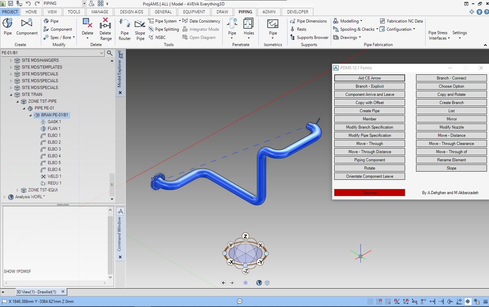
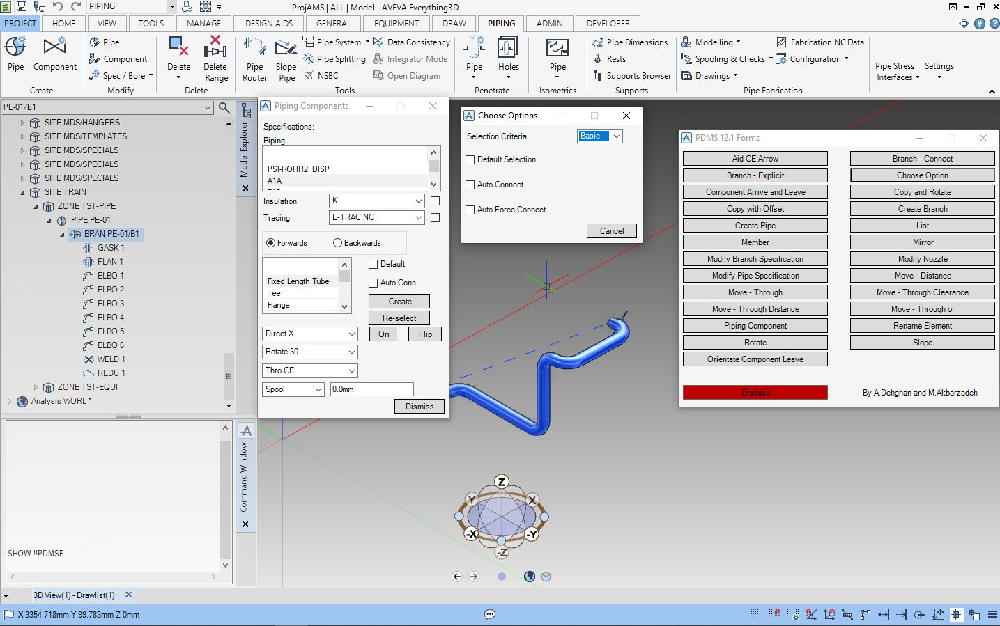

## 1. The Problem
Transitioning piping engineering operations from AVEVA PDMS 12.1 to AVEVA E3D presents a significant operational hurdle for EPC contractors and design teams. While AVEVA E3D introduces a modernized canvas and ribbon-based GUI, it requires a time for passing the learning curve for the team to master it and sometimes due to several reasons (Clients sudden pressure, Licencing issues and ...) this time does not exist.
 Forcing designers and lead engineers to abandon established, high-efficiency interfaces leads to user adaptation friction, steeper learning curves, increased drafting error rates, and costly training downtime.

## 2. The Logic Flow
To bridge the gap between legacy PDMS interfaces and the modern E3D environment, I developed a lightweight GUI migration macro written in PML:
- **Legacy Form Parsing:** The macro simply holds the form callback commands so by clicking a button, the legacy forms can be called inside the E3D modern environment.

## 3. The Result
Although in some scenarios, it is not suggested that the team use such tools, but in the special times mentioned above, using such tool can lift the pressure off the team and give them time to adapt to the completly revised design environment and pass the learning curve with ease of mind.

## 4. Visual Demonstration
*(Below are snapshots demonstrating the legacy PDMS 12.1 forms inside AVEVA E3D).*

