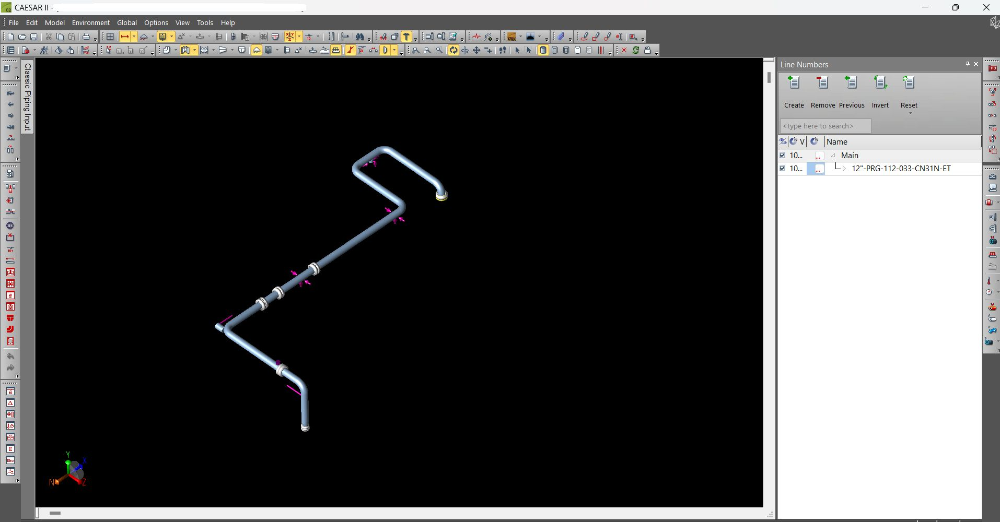
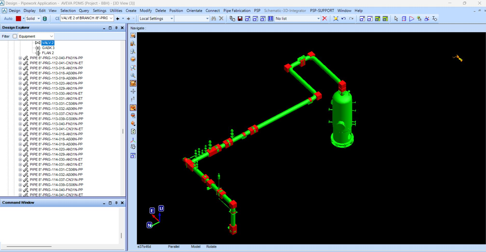

## 1. The Problem
In piping design, data transfer between Stress Analysis results in CAESAR II and 3D Piping model in AVEVA PDMS/E3D is a notoriously time-consuming bottleneck. Stress analysts and support engineers struggle to manually import and maintain updated load and geometry data within the 3D model. This manual data entry leads to wasting an enourmous amount of man/hour, causes discrepancies between models, and delays the generation of accurate SLD (Single Line Diagram) documents.

## 2. The Logic Flow
To bridge this gap and eliminate manual data entry, I developed an integration macro that connects CAESAR II outputs directly to the AVEVA database:
- **Data Parsing:** The macro reads and extracts data directly from the CAESAR II load reports.
- **Automated Modeling:** It automatically generates the corresponding basic elements (customizable) within the PDMS/E3D environment.
- **Attribute Assignment:** All reported loads are seamlessly attached to the 3D elements as system attributes, making them permanently available for any kind of deliverable needed.

## 3. The Result
This solution ensures the 3D model remains a single source of truth (SSOT) across disciplines. It enables the stress and support teams to visually verify the CAESAR II model against the actual PDMS/E3D model instantly. Also, embedded load report figures inside each elements will enable the department to produce SLD documents in DRAFT/DRAW module much faster and more accurately.

## 4. Visual Demonstration
*(Below are snapshots demonstrating the load report integration and the resulting attributes inside the 3D model).*

