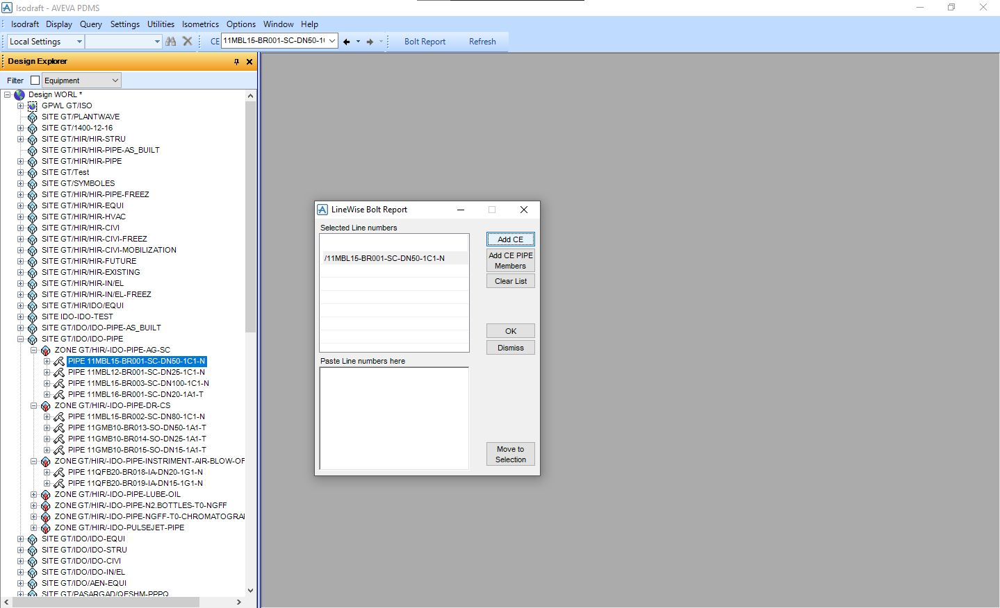
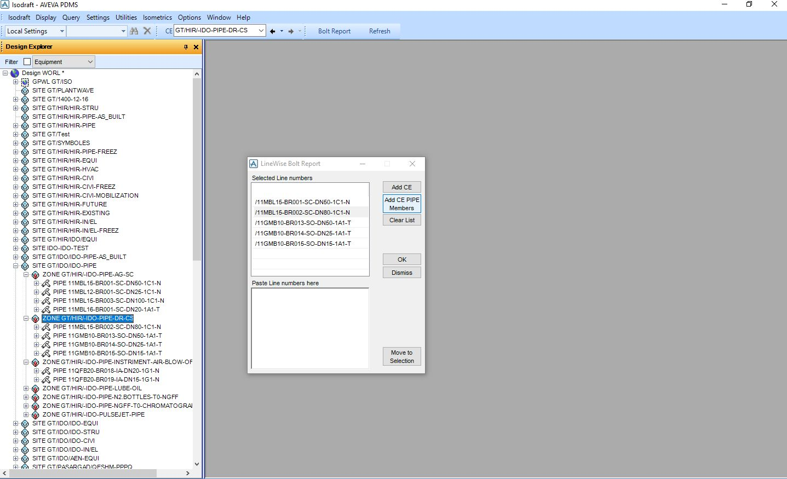
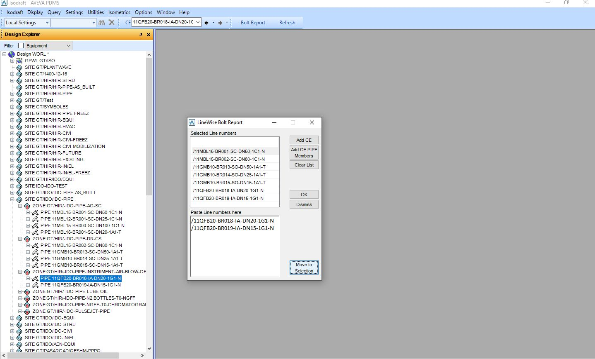

## 1. The Problem
Out of the box features of Aveva PDMS (12.1 and earlier) does not include a line-wise bolt report extraction tool and the only feature is the overall summerised MTO extraction which is accessible via the ISODRAFT module and sometimes (specially in the time of issuing new revision of MTOs) this will create limitaions in tracing changes in quantities.
The only way to trace Bolts MTO is with generating sheet-wise MTO and then extracting the Bolt quantities from it, till now:

## 2. The Logic Flow
To eliminate this limitation, I developed a custom PML utility focused on batch processing and report extraction:
- **Batch Selection Input:** Users can directly paste a batch selection of line numbers directly into the interface (with built-in validation checks to ensure lines exist in the database).
The macro check the database hierarchy for all specified lines, validating their existence and then, it will produce a Bolt MTO for the entered line numbers.
It queries the underlying catalog and design attributes to extract precise bolt sets, sizes, lengths, quantities, and material specs per line.
- **Report Generation:** The utility formats the extracted data into a structured line-wise report ready for immediate verification against Isometric drawings and procurement MTOs.

## 3. The Result
This tool transforms a tiring multi step report extraction and purification to an instant, bulk execution. By allowing designers and lead engineers to paste targeted batches of line numbers, it significantly reduces verification man-hours, eliminates human error in bolt counts, and ensures 100% data consistency between the 3D model and downstream deliverables.

## 4. Visual Demonstration
*(Below are snapshots demonstrating the batch input user interface and line selection query).*

