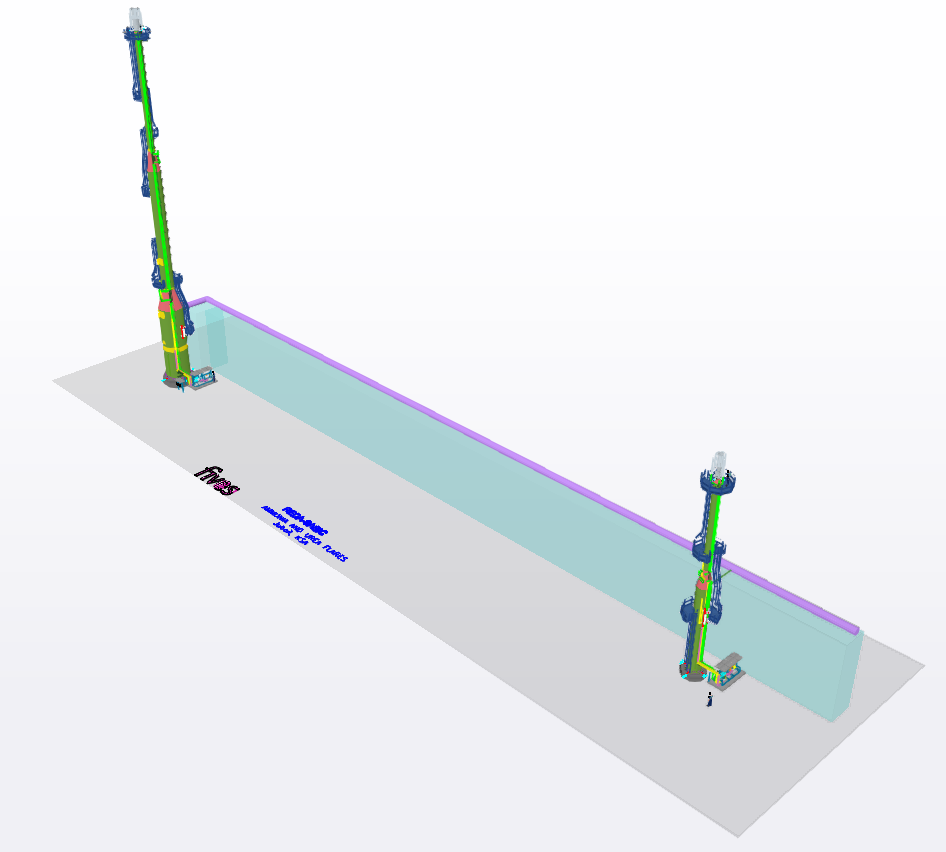
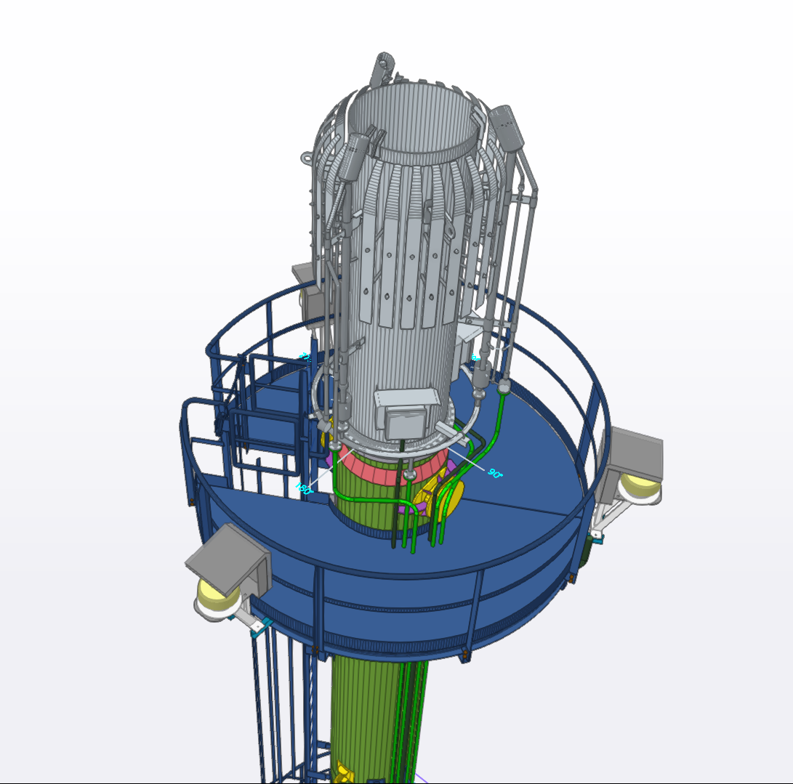
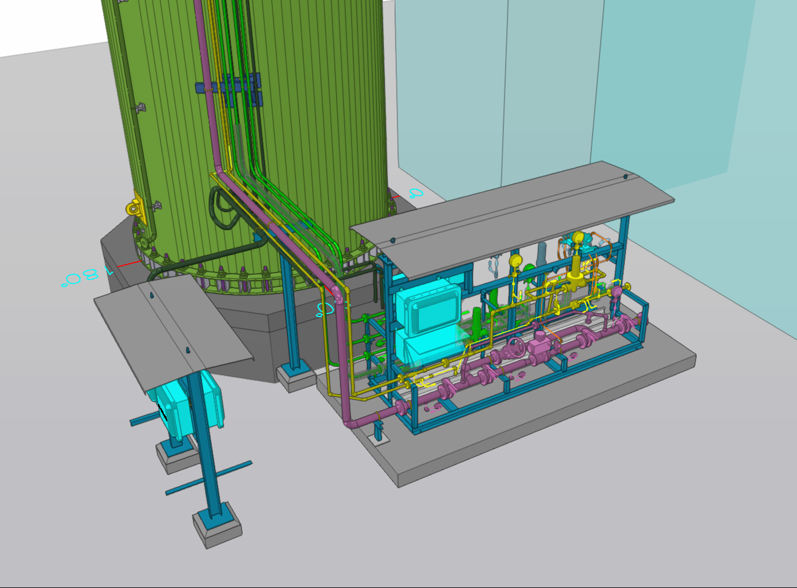
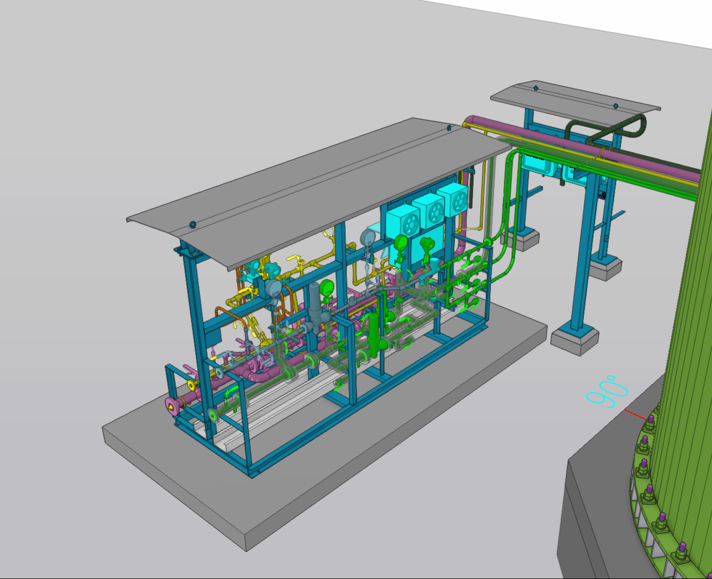
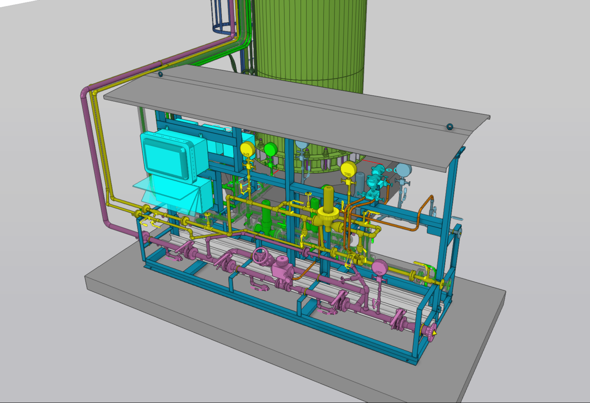

## 1. Project Scope & Facility Scale
The REDA project involved the complete piping design for two specialized flare stack systems—one dedicated to ammonia service and the other to urea service—contracted by ITAS (Fives ITAS S.p.A., Monza, Italy). The scope consisted of the comprehensive design of two ignition skids based on client P&IDs, alongside interconnecting pilot lines extending from the skids to the ignition pilots situated atop the flare stacks ($60\text{m}$ and $25\text{m}$ in height). 

The piping network used three primary ASME piping classes for four service fluids: Fuel Gas, Instrument Air, Nitrogen, and Service Water. Utility lines (Instrument Air, Nitrogen, Water) were specified in Carbon Steel per ASME B36.10/B16.9/B16.11 (ASTM A106 Gr. B, A105, A234 WPB), whereas Fuel Gas pilot feeds were routed in Stainless Steel (ASTM A312 TP 304 and TP 316L) in accordance with ASME B31.3 Process Piping standards. Complete 3D modeling was executed in AutoCAD Plant 3D, generating full piping plans, General Arrangement (GA) skid layouts, Material Take-Offs (MTOs), and isometric drawings.

## 2. Core Engineering Challenges
The dominant engineering hurdle was the severe spatial limitation on the main skid footprint ($4600\text{mm} \times 2200\text{mm}$). 11 Line numbers from 3" to 1", more than 10 custom instrumental valves with tubings, and 5 junction boxes and electric components with resereved maintenance areas, made every inch of space important and accounted for. The volume of data in this project was managable, but the main challenge was the design.

## 3. Problem Solving & Inter-Disciplinary Execution
To resolve the high component density and maintain strict compliance with ASME B31.3 and client accessibility rules without exceeding schedule limits, I used custom .NET (C#) API automation tools developed specifically for AutoCAD Plant 3D (`Autodesk.ProcessPower.PlantInstance`).

- **Automated Quality Control:** Developed custom C# scripts to perform real-time model auditing, automatically flagging disconnected components, identifying tag format anomalies against client syntax rules, flaging clashed items and isolating MTO discrepancies between drawing revisions.
- **Progress Tracking & Model Delivery:** Engineered automated progress reporting routines tied to custom line attributes, generating weekly progress dashboards alongside Navisworks models uploaded every Monday morning for client review.
- **Clash & Accessibility Management:** Carefully optimized valve stem orientations, maintenance clearance around Junction Boxes, and structural skid tie-in points within the $4600\text{mm} \times 2200\text{mm}$ boundary to ensure compliance with Fives ergonomic standards.

## 4. Final 3D Model & Deliverables
*(Below are snapshots of the finalized 3D model demonstrating the skid layout, JB door clearances, and pilot piping configurations).*

