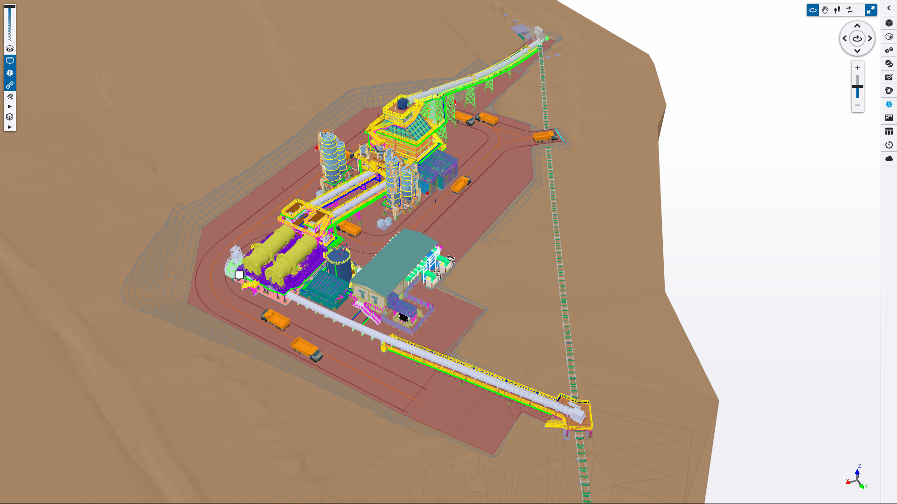
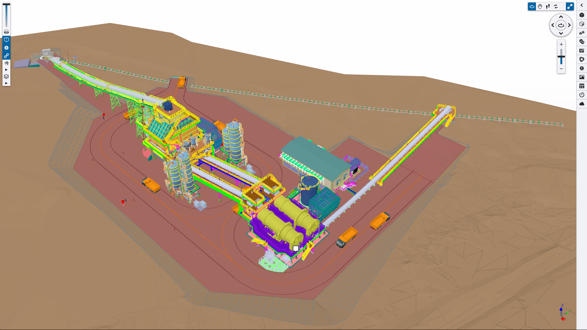
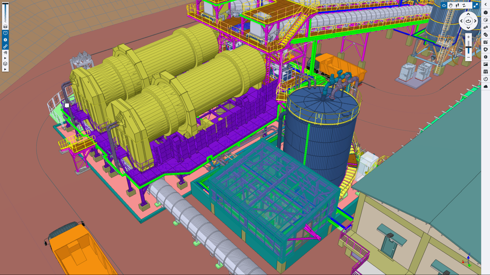
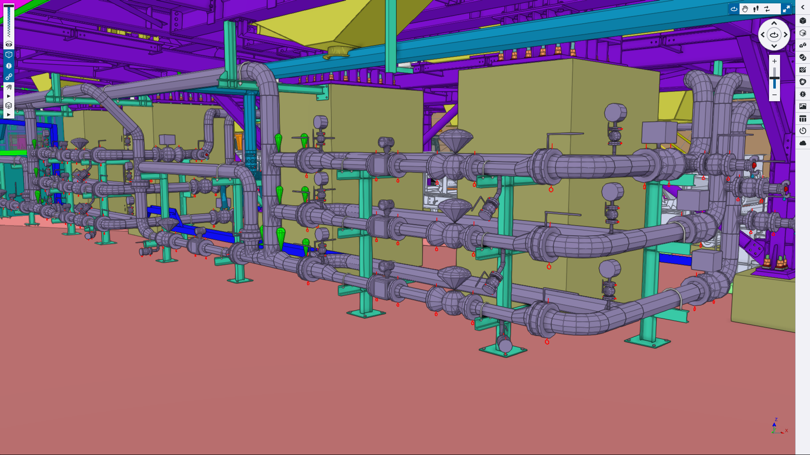
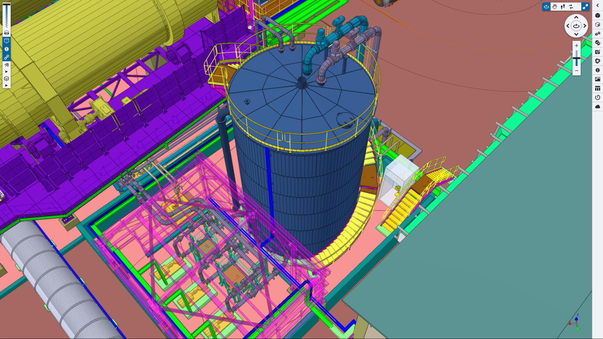
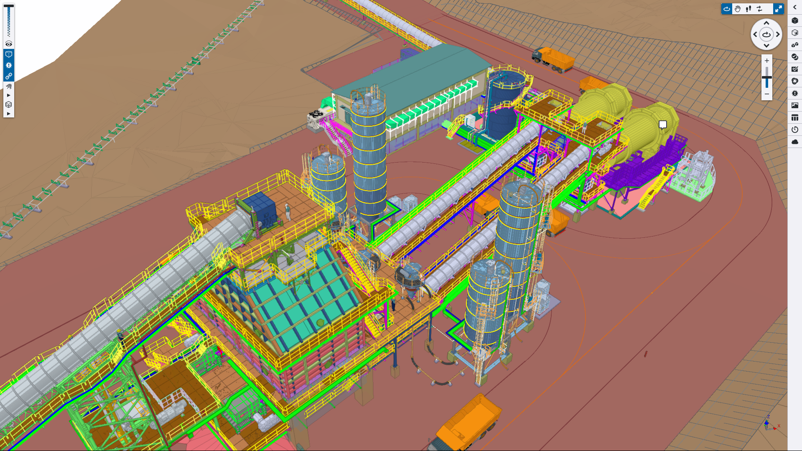

## 1. Project Scope & Facility Scale
The current <strong>Kışladağ Gold Mine Plant at Uşak province of Turkiye</strong> was planned to house a pair of Agglomeration equipments along with all the necessary facilities to include it in the current, on-going plant. Therefore, A complete Cyanide injection system along with a 10 meter-height Storage Tank, Injection Pumps, Flow Control Stations and all the necessary facilities was added to the current plant.
New layout of the added facilities and piping network was in our scope to design and deliver via a complete list of Piping deliverables (Isometric Drawings, Piping Plans, MTOs and ...)

## 2. Core Engineering Challenges
The primary engineering constraint was the nature of the working fluid. Because the system transported a highly toxic cyanide solution, the piping design had to strictly adhere to **ASME B31.3 Category M Fluid Service** requirements, dictating stringent design policies for leak-tightness and severe service parameters.
Furthermore, the original P&IDs were sized for a smaller capacity plant. With no dedicated process engineering team available, I absorbed that scope and independently performed the hydraulic calculations to establish the correct line sizes for the upgraded flow rates.
The piping department consisted solely of myself and the manager. I was responsible for executing the entire modeling and deliverable extraction scope single-handedly under an aggressive timeline.

## 3. Problem Solving & Inter-Disciplinary Execution
I used Trimble Connect for real-time model sharing so there would be a seamless coordination with other departments. To eliminate manual bottlenecks, I deployed a suite of custom automations:
- **Automated Model Syncing:** I implemented an automated application to automatically export the 3D Navisworks model from AutoCAD and upload it to Trimble Connect at the close of every workday.
- **Revision Control:** I engineered a custom Excel data model to automate MTO reporting, allowing management to instantly track material differences between drawing revisions.
- **AI implementation:** By using my personal AI assistant, I was able to watch for common errors through the design such as Tag inconsistency with P&IDs, disconnected components, missaligned piping runs, gasket/flange rating/facing incompatibility and so on.

## 4. Final 3D Model & Deliverables
*(Below are snapshots of the finalized 3D model demonstrating the complexity and scale of the completed piping design).*

