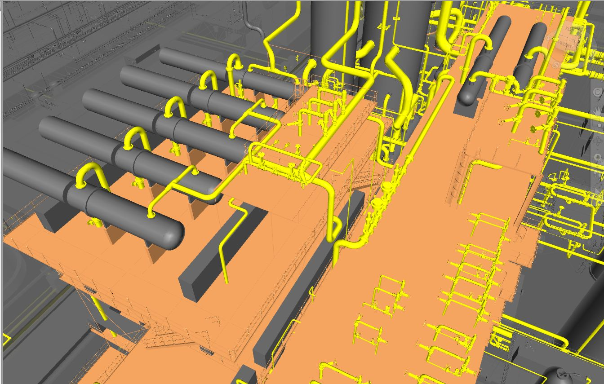
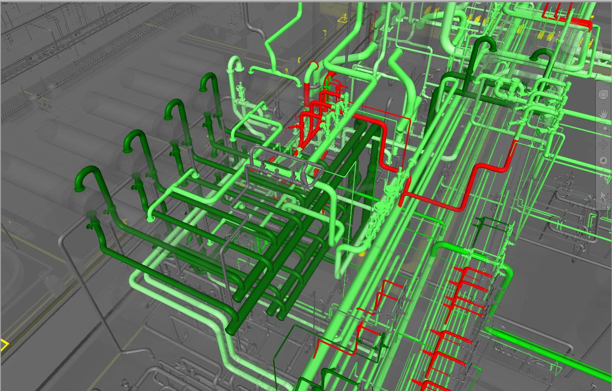
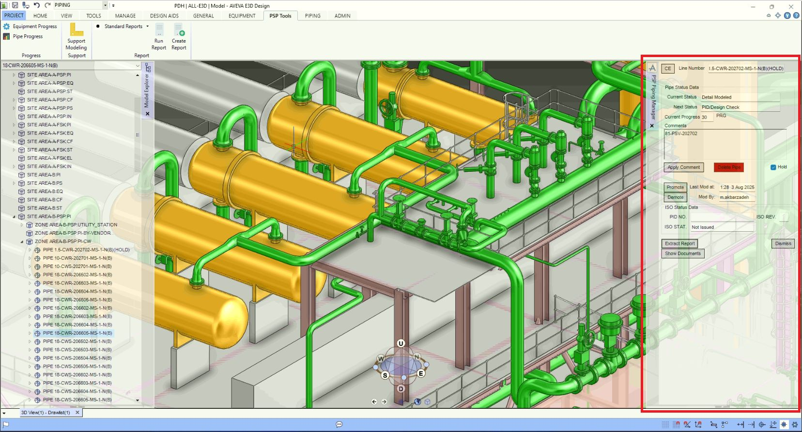

## 1. The Problem
Piping Department Managers and Project Specific Leaders (PSLs) require real-time visibility into the 3D model’s progress down to every line number. While AVEVA’s built-in "Status Control" is a capable tool, some companies prefer their own Progress Monitoring system, which is tailored specifically to their predefined milestones for each individual project. Furthermore, syncing these progress milestones to each user's access to 3d model elements will prevent unauthorized geometry changes.

## 2. The Logic Flow
To provide this service for demanding companies, I developed a custom PML macro that creates absolute control over modeling progress:
- **Automated Progress Assignment:** The tool assigns and removes progress values to DESIGN elements (PIPE, EQUI, STRU, etc.) strictly based on a predefined schedule set by the PSL and department manager.
- **Dynamic Access Management:** Once a line reaches a specific milestone (e.g., preliminary design complete),  write access from the Piping Designer (in this example) will be revoked, and the Stress/Support team will grant it.
- **Automated Deliverable Integration:** When a line is flagged as "HOLD," the macro embeds comments that automatically populate onto extracted drawings (such as Isometrics).
- **Customizable Reporting:** This tool is capable of instantly generating progress reports with customizable detail levels tailored for management. Also, it can send an Email to the PSL or the department manager on the predefined schedules (e.g., daily reports at 18:00, weekly reports on FRI at 17:00, and ...).

## 3. The Result
This system entirely eliminates unauthorized mid-project 3D model manipulations and reduces the report-preparation time for management to a single click. By bridging the gap between raw data and visual representation, it provides PSLs with absolute, real-time control over the modeling timeline.

## 4. Visual Demonstration
One especially useful feature for Project and Engineering managers is the macro's ability to export a Navisworks file with visual status attributes.
This allows decision-makers to see at a glance which areas are finished, in progress, on HOLD, or not yet started. 

*(In the snapshots below, progress highlighting scales from light green for lower progress to dark green for higher progress, with red indicating HOLD lines).*

