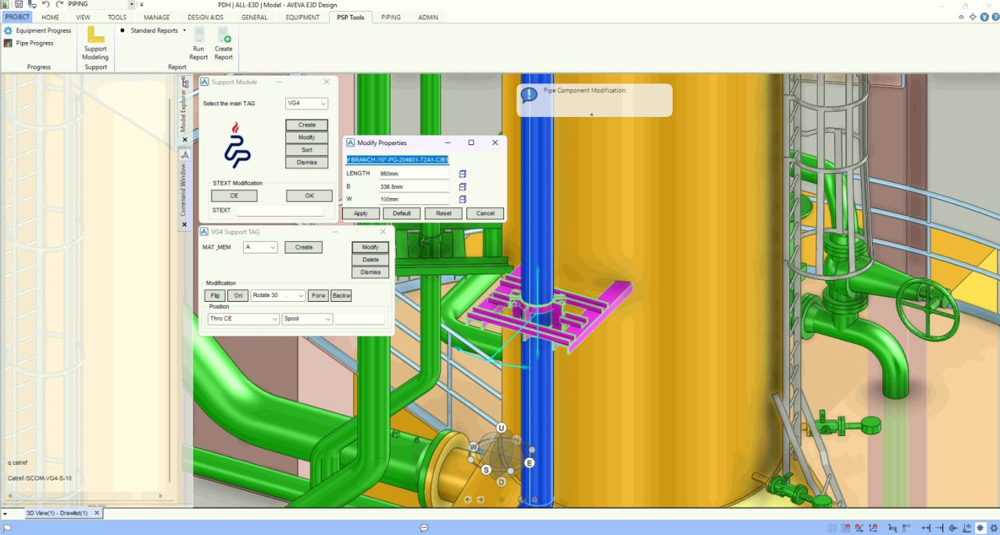
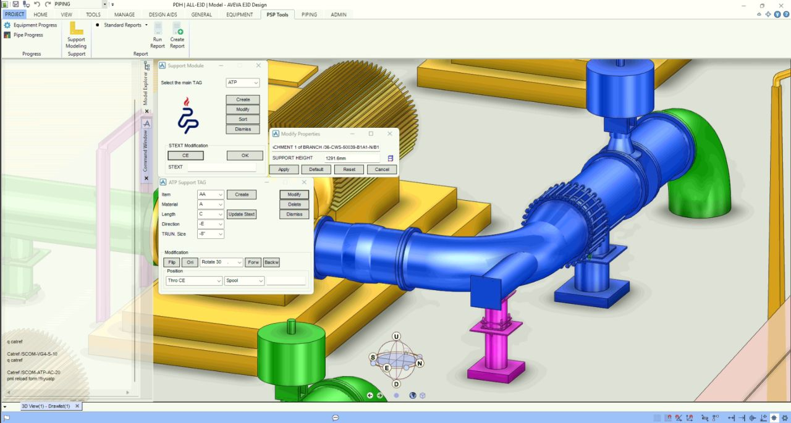

## 1. The Problem
In mid- to large-scale EPC projects, 3D pipe support modeling must strictly comply with specific governing documents: Standard Pipe Support Drawings and Special Pipe Support Drawings.
While AVEVA E3D/PDMS provides standard tools, many companies have their own developed support components, or in many projects, a specific Standard Support Drawing document is enforced by the Client. Furthermore, most of the companies model these supports either in a symbolized method (by using general ATTA elements in Aveva) or if they have the custom built catalogue DBs, they use them via the traditional "Create Component" UI in Aveva E3D/PDMS. This workflow creates bottlenecks in the support modeling phase and especially when extracting accurate Material Take-Offs (MTO) and calculating line-wise support weights for the Structural and Procurement departments come to play.

## 2. The Logic Flow
To standardize this process and eliminate manual tagging errors, I developed a custom Support Modeling Interface and Catalogue package (for several companies which use the same Standard Pipe Support document):
- **Automated Tagging:** The macro automatically generates precise STEXT (Support Tags) with minimal user input.
- **Geometric Compliance:** Support geometry is instantly generated and aligned to perfectly match governing project documents.
- **Modeled Mobility:** The tool provides full flexibility in the 3D space, allowing users to seamlessly move, rotate, and copy support assemblies without breaking the underlying data structure.
- **Automated Data Calculation:** As supports are modeled, the script automatically executes line-wise MTO and weight calculations, embedding this critical data directly into the modeled component.

## 3. The Result
This custom interface drastically accelerates the support modeling process while guaranteeing 100% geometric and tag compliance with project specifications. By automating the weight and MTO calculations line-by-line, it actively generates clean, error-free data for Structural and Procurement teams, eliminating inter-disciplinary data gaps.

## 4. Visual Demonstration
*(Below are snapshots demonstrating the custom modeling interface and the generated support geometry inside the 3D model.)*

